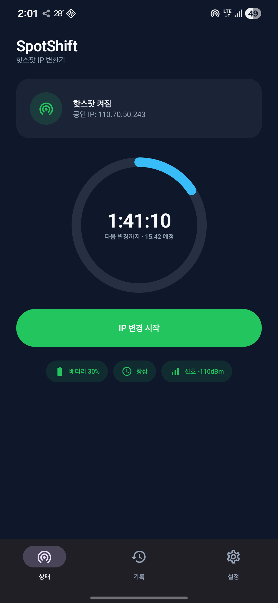

# SpotShift — 핫스팟 IP 자동 변경기

Android 기기를 핫스팟으로 사용하며, 설정한 주기마다 모바일 네트워크 IP를 자동으로 바꿔주는 무루트 앱입니다. IP 변경 후 모바일 데이터와 핫스팟을 원래 상태로 자동 복원합니다.

- **무루트**: Shizuku 기반 (루트 권한 불필요)
- **서버 없음**: 모든 처리가 기기 안에서만 이뤄짐 (데이터 수집 없음)
- **Android 8.0 (API 26) 이상** · 갤럭시 S22 실기기 검증
- 랜딩 페이지: https://borasarang.github.io/SpotShift/

---

## 다운로드

| 항목 | 링크 |
|------|------|
| APK (v0.3.1) | [GitHub Releases](https://github.com/BoraSarang/SpotShift/releases/latest) — `app-release.apk` |
| 소스 코드 | [BoraSarang/SpotShift](https://github.com/BoraSarang/SpotShift) |
| 버그 신고 | [GitHub Issues](https://github.com/BoraSarang/SpotShift/issues) |
| 문의 | leeborasarang@gmail.com |

> **해외(일본 등) 사용**: 이 페이지와 APK는 한국·일본 어디서나 접속·다운로드됩니다. Play 스토어가 필요 없으며, IP 변경은 로컬에서 이뤄지므로 로밍 상태와 무관하게 동작합니다.



---

## 설치 방법 (상세 가이드)

### 준비물
- Android 8.0 이상 기기
- Shizuku 앱 (무루트 권한 시스템 — 필수)

### 1단계: Shizuku 설치

- **Play 스토어**: [Shizuku (moe.shizuku.privileged.api)](https://play.google.com/store/apps/details?id=moe.shizuku.privileged.api)
- **GitHub**: [RikkaApps/Shizuku Releases](https://github.com/RikkaApps/Shizuku/releases/latest)

### 2단계: Shizuku 활성화 (무선 디버깅 방식 — 갤럭시 One UI 기준)

1. **개발자 옵션 켜기**: `설정 → 휴대전화 정보 → 소프트웨어 정보 → 빌드 번호` 7번 탭
2. `설정 → 개발자 옵션 → USB 디버깅` ON
3. `설정 → 개발자 옵션 → 무선 디버깅` ON (팝업이 뜨면 허용)
4. Shizuku 앱 실행 → **"무선 디버깅으로 시작"** 탭
5. 페어링 코드 입력: `설정 → 개발자 옵션 → 무선 디버깅 → 페어링 기기 쌍 연결`에서 코드 확인 → 입력 → **"항상 허용"** 체크
6. Shizuku 화면 상단이 **Running**이 되면 완료

> 부팅 후에는 Shizuku 앱을 다시 열어 재시작해야 합니다.

### 3단계: SpotShift APK 다운로드 + 설치

1. [GitHub Releases](https://github.com/BoraSarang/SpotShift/releases/latest)에서 `app-release.apk` 다운로드
2. 다운로드 알림에서 APK 탭 → "이 앱을 설치할 수 없습니다" 안내가 뜨면 **설정** 탭
3. 갤럭시 경로: `설정 → 생체 인식 및 보안 → 기타 보안 설정 → 알 수 없는 앱 설치` → 사용 브라우저 선택 → **"이 앱 허용" ON**
4. APK 다시 탭 → **설치** → **열기**

> **보안 안내**: "알 수 없는 소스 허용"은 선택한 브라우저에만 적용됩니다. `app-release.apk`(정식 서명) 외 출처 불명 APK는 설치하지 마세요.

### 4단계: 권한 연결 + 시작

1. 앱 실행 → **설정 탭** → **권한 요청** → Shizuku 다이얼로그에서 **"항상 허용"**
2. 설정 탭이 **"연결됨"**으로 바뀌면 성공
3. 홈에서 **변경 주기 설정** (10분~24시간) + 원하는 옵션 (셀룰러 전용 / 변경 건너뛰기 / 기록 초기화)
4. 기기 **핫스팟 ON** → 홈 **자동 변경 시작** 토글 ON
5. 설정한 시각마다 IP 자동 변경 — **예상 변경 시각**은 홈 화면과 상태 알림에서 확인

---

## 기능

- **주기 자동 변경**: 10분~24시간 주기 설정, IP 자동 변경
- **자동 복원**: 모바일 데이터 재연결 우선 → 에어플레인 모드 폴백 (기기별 안정성)
- **셀룰러 전용 모드**: Wi-Fi 환경에서도 셀룰러 IP만 변경
- **변경 건너뛰기**: 핫스팟 OFF 상태에서는 IP 변경을 건너뜀
- **상태 알림**: 현재 IP / 예상 변경 시각 / 진행 단계 (설정에서 OFF 가능)
- **기록 초기화**: 변경 이력 초기화
- **변경 이력 없음 처리**: 첫 실행 시 "아직 변경 이력이 없습니다" 안내

---

## 업데이트

같은 [GitHub Releases 페이지](https://github.com/BoraSarang/SpotShift/releases/latest)에서 새 APK를 받아 설치하면 됩니다. **같은 릴리즈 키로 서명**되므로 설정과 데이터가 유지된 채 업데이트됩니다.

## 개발

```bash
cd android
./gradlew assembleDebug --no-daemon     # 디버그 빌드
./gradlew assembleRelease --no-daemon   # 릴리즈 빌드 (서명: local.properties의 keystore 정보)
```

릴리즈 서명 키(`keystore/release.jks`)와 비밀번호는 `local.properties`에 분리 보관하며, 커밋에서 제외됩니다 (.gitignore).

## 버전 이력

- **v0.3.1** (2026-08-16) — 첫 릴리즈. 카운트다운 수정 · 서비스 자동 복원 · 배지 제거 · IP 재조회
- **v0.3.0** — 홈 개선 (예상 변경 시각 · 진행 단계 · 문의 섹션)
- **v0.2.x** — 사용자 요구사항 6종 (셀룰러 전용/주기/스킵/기록 초기화/알림/토글)
- **v0.1.x** — 초기 골격 + 실기기 검증 (데이터 재연결 우선 전략)

## 라이선스

비공개 (개인 배포). 문의: leeborasarang@gmail.com