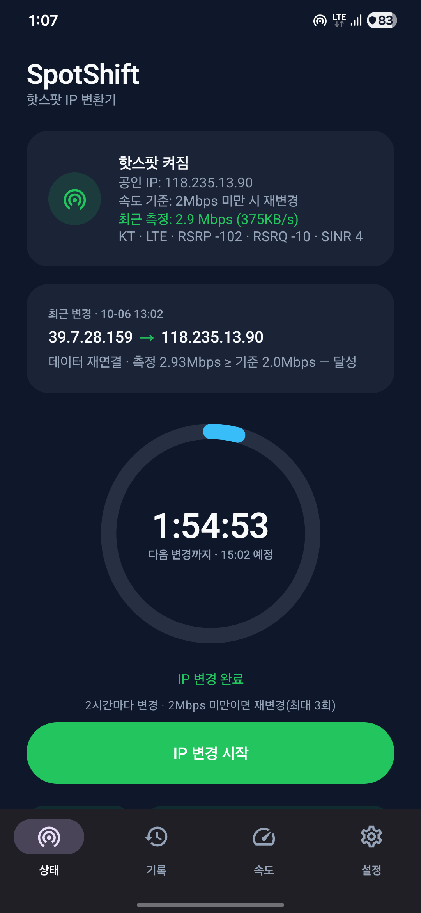
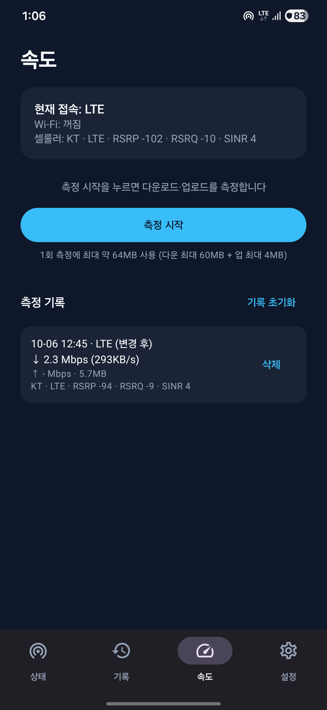

# SpotShift — Automatic Hotspot IP Changer

An Android app that uses your phone as a hotspot and automatically rotates the mobile-network IP on a schedule, then restores mobile data and hotspot to their original state. Rootless (Shizuku-based), no server, no data collection.

- **Rootless**: Shizuku-based (no root required)
- **No server**: everything runs on-device
- **Android 8.0 (API 26)+** · verified on Galaxy S22
- Korean guide: [README.ko.md](README.ko.md)
- Landing page: https://borasarang.github.io/SpotShift/

---

## Download

| Item | Link |
|------|------|
| APK (v0.5.0) | [GitHub Releases](https://github.com/BoraSarang/SpotShift/releases/latest) — `app-release.apk` |
| Source | [BoraSarang/SpotShift](https://github.com/BoraSarang/SpotShift) |
| Issues | [GitHub Issues](https://github.com/BoraSarang/SpotShift/issues) |
| Contact | leeborasarang@gmail.com |




---

## Setup (detailed)

### Requirements

- Android 8.0+ device
- Shizuku app (rootless privilege system — required)

### Step 1: Install Shizuku

- **Play Store**: [Shizuku (moe.shizuku.privileged.api)](https://play.google.com/store/apps/details?id=moe.shizuku.privileged.api)
- **GitHub**: [RikkaApps/Shizuku Releases](https://github.com/RikkaApps/Shizuku/releases/latest)

### Step 2: Activate Shizuku (wireless debugging — Galaxy One UI)

1. Enable developer options: tap `Settings → About phone → Software information → Build number` 7 times
2. `Settings → Developer options → USB debugging` ON
3. `Settings → Developer options → Wireless debugging` ON (allow when prompted)
4. Open Shizuku → **"Start via Wireless debugging"** tab
5. Enter pairing code: `Settings → Developer options → Wireless debugging → Pair device with pairing code` → enter it, check **"Always allow"**
6. Done when Shizuku shows **Running** at the top

> Shizuku must be restarted from its app after every reboot.

### Step 3: Download + install the SpotShift APK

1. Download `app-release.apk` from [GitHub Releases](https://github.com/BoraSarang/SpotShift/releases/latest)
2. Tap the APK → if blocked, open **Settings**
3. Galaxy path: `Settings → Biometrics and security → Other security settings → Install unknown apps` → pick your browser → **Allow**
4. Tap the APK again → **Install** → **Open**

### Step 4: Permissions + start

1. Open the app → **Settings tab** → **Request permission** → Shizuku dialog → **"Always allow"**
2. Success when the Settings tab shows **connected**
3. On Home, set the **interval** (15 min – 24 h) and options (cellular-only / history reset)
4. Turn the device **hotspot ON** → Home **Auto change** toggle ON
5. IP rotates automatically — **next change time** is shown on Home and in the status notification

---

## Features

- **Scheduled rotation**: 15 min – 24 h interval, automatic IP change
- **Auto recovery**: mobile-data reconnect first → airplane-mode fallback
- **Cellular-only mode**: rotates only the cellular IP even around Wi-Fi
- **Skip on hotspot-off**: skips rotation while hotspot is off
- **Status notification**: current IP / next change time / progress stage
- **Speed tab**: fast.com-style real-time down/up/latency test, history with per-item delete + confirmed reset, one-tap IP change on slow result with before/after compare
- **History reset**: clears change history

---

## Updating

Download the new APK from the same [Releases page](https://github.com/BoraSarang/SpotShift/releases/latest) and install it. It is signed with the **same release key**, so settings and data are preserved.

## Development

```bash
cd android
./gradlew assembleDebug --no-daemon     # debug build
./gradlew assembleRelease --no-daemon   # release build (keystore from local.properties)
```

Release signing keys (`keystore/release.jks`) and passwords stay in `local.properties`, excluded from git (.gitignore). CI release builds (`.github/workflows/release.yml`) use `KEYSTORE_BASE64` / `KEYSTORE_PASSWORD` / `KEY_ALIAS` repository secrets and publish `app-release.apk` to GitHub Releases on `v*` tags.

## Version history

- **v0.5.0** — WorkManager scheduler (fixes background restart crashes), Speed tab, history-reset confirm
- **v0.3.1** — first release. Countdown fix, service auto-restore, badge removal, IP re-query
- **v0.3.0** — home improvements (expected time, progress stage, contact section)
- **v0.2.x** — 6 user requirements (cellular-only/interval/skip/history reset/notification/toggle)
- **v0.1.x** — initial skeleton + on-device verification (data-reconnect-first strategy)

## License

MIT — see [LICENSE](LICENSE). Contact: leeborasarang@gmail.com
